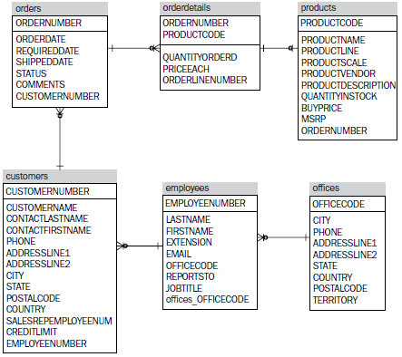

# steelwheels-data-hsqldb
Steelwheels data set in hsqldb format

This project contains the Steelwheels data set as an embedded
HSQLDB database.

It originated as part of the test suite of the
<a href="http://mondrian.pentaho.org">Pentaho Mondrian OLAP engine</a>.

# Schema

Steelwheels contains 13 tables:

| Table | Row count |
| ----- | --------: |
| customer_w_ter | 126 |
| customers | 126 |
| department_managers | 4 |
| employees | 23 |
| offices | 7 |
| orderdetails | 3,001 |
| orderfact | 2,996 |
| orders | 330 |
| payments | 272 |
| products | 110 |
| quadrant_actuals | 148 |
| time | 265 |
| trial_balance | 22 |

Its size is about 1MB uncompressed, 124KB compressed.

Here is a schema diagram:



# Using the data set

The data set is packaged as a jar file that is published to
[Maven Central](https://search.maven.org/#search%7Cga%7C1%7Ca%3Asteelwheels-data-hsqldb)
as a Maven artifact. To use the data in your Java application,
add the artifact to your project's dependencies:

```xml
<dependency>
  <groupId>net.hydromatic</groupId>
  <artifactId>steelwheels-data-hsqldb</artifactId>
  <version>0.1</version>
</dependency>
```

Now you can connect using Java code:

```java
import java.sql.Connection;

Connection connection =
  DriverManager.getConnection("jdbc:hsqldb:res:steelwheels", "steelwheels", "");
Statement statement = connection.createStatement();
ResultSet resultSet =
  statement.executeQuery("select lastname"\n"
      + "from \"steelwheels\".\"employees\"");
while (resultSet.next()) {
  System.out.println(resultSet.getInt(1) + ":" + resultSet.getString(2));
}
resultSet.close();
statement.close();
connection.close();
```

You can also connect using a JDBC interface such as [sqlline](https://github.com/julianhyde/sqlline).
Make sure that `steelwheels-data-hsqldb.jar` is on the class path, and start `sqlline`:

```sql
$ ./sqlline
sqlline version 1.2.0
sqlline> !connect jdbc:hsqldb:res:steelwheels steelwheels ""
0: jdbc:hsqldb:res:steelwheels> select count(*) from "steelwheels"."employees";
+----------------------+
|          C1          |
+----------------------+
| 23                   |
+----------------------+
1 row selected (0.004 seconds)
0: jdbc:hsqldb:res:steelwheels> !quit
```

## Get steelwheels-data-hsqldb

### From Maven

Get steelwheels-data-hsqldb from
<a href="https://search.maven.org/#search%7Cga%7C1%7Cg%3Anet.hydromatic%20a%3Asteelwheels-data-hsqldb">Maven Central</a>:

```xml
<dependency>
  <groupId>net.hydromatic</groupId>
  <artifactId>steelwheels-data-hsqldb</artifactId>
  <version>0.1</version>
</dependency>
```

### Download and build

Java version 8 or higher.

```bash
$ git clone git://github.com/julianhyde/steelwheels-data-hsqldb.git
$ cd steelwheels-data-hsqldb
$ ./mvnw install
```

+On Windows, the last line is

```bash
> mvnw install
```

### Make a release

See [hydromatic-parent](https://github.com/julianhyde/hydromatic-parent).

## See also

Similar data sets:
* [chinook-data-hsqldb](https://github.com/julianhyde/chinook-data-hsqldb)
* [foodmart-data-hsqldb](https://github.com/julianhyde/foodmart-data-hsqldb)
* [scott-data-hsqldb](https://github.com/julianhyde/scott-data-hsqldb)
* [steelwheels-data-hsqldb](https://github.com/julianhyde/steelwheels-data-hsqldb)

## More information

* License: Apache License, Version 2.0
* Author: Julian Hyde
* Blog: http://blog.hydromatic.net
* Project page: http://www.hydromatic.net/steelwheels-data-hsqldb
* Source code: https://github.com/julianhyde/steelwheels-data-hsqldb
* Distribution: <a href="https://search.maven.org/#search%7Cga%7C1%7Ca%3A%22steelwheels-data-hsqldb%22">Maven Central</a>
* Developers list:
  <a href="mailto:dev@calcite.apache.org">dev at calcite.apache.org</a>
  (<a href="https://mail-archives.apache.org/mod_mbox/calcite-dev/">archive</a>,
  <a href="mailto:dev-subscribe@calcite.apache.org">subscribe</a>)
* Issues: https://github.com/julianhyde/steelwheels-data-hsqldb/issues
* <a href="HISTORY.md">Release notes and history</a>
